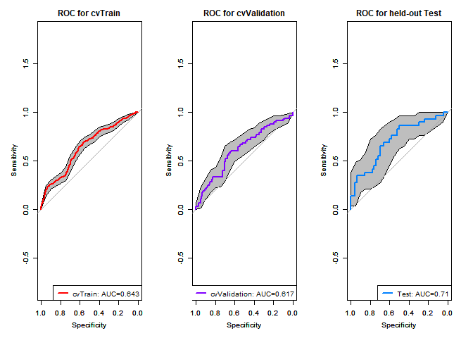
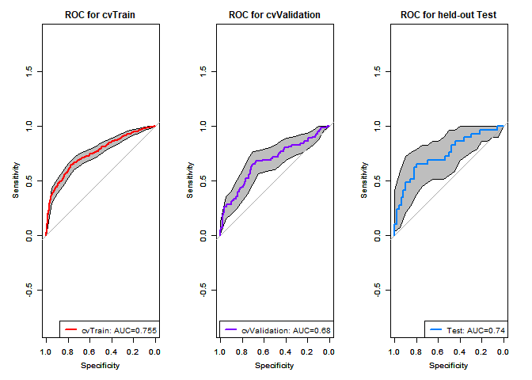
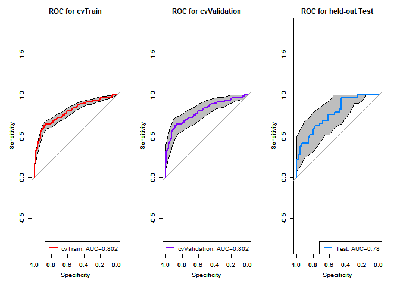

# AUC comparison: Boostrap method
## AUC difference significance testing
 
   * Computation details:
   a) boot.n (2000) bootstrap replicates are drawn from the data. If boot.stratified = TRUE, each replicate contains exactly the same number of controls and cases than the original sample
   
   b) for each bootstrap replicate, the AUC of the two ROC curves are computed and the difference is used:
   $$  D =  \frac{AUC_1-AUC_2}{std(AUC_1-AUC_2)} \sim Z$$
     where $std$ is the standard deviation of the bootstrap differences and AUC1 and AUC2 the AUC of the two (bootstrap replicate) ROC curves.
   
   c) Z approximately follows a normal distribution, one or two-tailed p-values can be calculated accordingly.

## For exp1: 

```r
library(pROC)
```

```
## Type 'citation("pROC")' for a citation.
```

```
## 
## Attaching package: 'pROC'
```

```
## The following objects are masked from 'package:stats':
## 
##     cov, smooth, var
```

```r
library(readr)
```

```
## Warning: package 'readr' was built under R version 3.3.3
```

```r
setwd("Z:/Cristina/Section3/paper_notes_section3_MODIFIED")
exp1_pooled_pred_train <- read_csv("datasets/exp1b_pooled_pred_train.csv")
```

```
## Parsed with column specification:
## cols(
##   labels = col_integer(),
##   probC = col_double(),
##   probNC = col_double()
## )
```

```r
exp1_pooled_pred_val <- read_csv("datasets/exp1b_pooled_pred_val.csv")
```

```
## Parsed with column specification:
## cols(
##   labels = col_integer(),
##   probC = col_double(),
##   probNC = col_double()
## )
```

```r
exp1_pred_test <- read_csv("datasets/exp1b_pred_test.csv")
```

```
## Parsed with column specification:
## cols(
##   labels = col_integer(),
##   probC = col_double(),
##   probNC = col_double()
## )
```

```r
# Create 6 objects: Tr_exp1, ciobj_Tr_exp1, Val_exp1, ciobj_val_exp1, Te_exp1, ciobj_Te_exp1
# plot ROC curve
################
library(pROC)
par(mfrow = c(1, 3))
par(cex = 0.6)
par(mar = c(3, 3, 0, 0), oma = c(0.51, 0.51, 0.51, 0.51))
n=12
colors = rainbow(n, s = 1, v = 1, start = 0, end = max(1, n - 1)/n, alpha = 1)
# plot
Tr_exp1 <- plot.roc(exp1_pooled_pred_train$labels, exp1_pooled_pred_train$probC, col=colors[1], lty=1)
ciobj_Tr_exp1 <- ci.se(Tr_exp1, specificities=seq(0, 1, 0.05)) 
plot(ciobj_Tr_exp1, type="shape", col="grey") # plot as a grey shape
par(new=TRUE)
plot.roc(exp1_pooled_pred_train$labels, exp1_pooled_pred_train$probC, col=colors[1], lty=1, main="ROC for cvTrain")
```

```
## 
## Call:
## plot.roc.default(x = exp1_pooled_pred_train$labels, predictor = exp1_pooled_pred_train$probC,     col = colors[1], lty = 1, main = "ROC for cvTrain")
## 
## Data: exp1_pooled_pred_train$probC in 868 controls (exp1_pooled_pred_train$labels 0) < 324 cases (exp1_pooled_pred_train$labels 1).
## Area under the curve: 0.6428
```

```r
legend("bottomright", 
       legend = c(paste0("cvTrain: AUC=", format(Tr_exp1$auc,digits=3, format="f"))), 
       col = colors[1],lwd = 2, lty = c(1))

# plot
Val_exp1 <- plot.roc(exp1_pooled_pred_val$labels, exp1_pooled_pred_val$probC, col=colors[1], lty=1)
ciobj_val_exp1 <- ci.se(Val_exp1, specificities=seq(0, 1, 0.05)) 
plot(ciobj_val_exp1, type="shape", col="grey") # plot as a blue shape
par(new=TRUE)
plot.roc(exp1_pooled_pred_val$labels, exp1_pooled_pred_val$probC, col=colors[10], lty=1, main="ROC for cvValidation")
```

```
## 
## Call:
## plot.roc.default(x = exp1_pooled_pred_val$labels, predictor = exp1_pooled_pred_val$probC,     col = colors[10], lty = 1, main = "ROC for cvValidation")
## 
## Data: exp1_pooled_pred_val$probC in 217 controls (exp1_pooled_pred_val$labels 0) < 81 cases (exp1_pooled_pred_val$labels 1).
## Area under the curve: 0.6169
```

```r
legend("bottomright", 
       legend = c(paste0("cvValidation: AUC=", format(Val_exp1$auc, digits=3, format="f"))), 
       col = colors[10],lwd = 2, lty = c(1))
# plot
Te_exp1 <- plot.roc(exp1_pred_test$labels, exp1_pred_test$probC, col=colors[8], lty=1)
ciobj_Te_exp1 <- ci.se(Te_exp1, specificities=seq(0, 1, 0.05)) 
plot(ciobj_Te_exp1, type="shape", col="grey") # plot as a grey shape
par(new=TRUE)
plot.roc(exp1_pred_test$labels, exp1_pred_test$probC, col=colors[8], lty=1, main="ROC for held-out Test")
```

```
## 
## Call:
## plot.roc.default(x = exp1_pred_test$labels, predictor = exp1_pred_test$probC,     col = colors[8], lty = 1, main = "ROC for held-out Test")
## 
## Data: exp1_pred_test$probC in 50 controls (exp1_pred_test$labels 0) < 29 cases (exp1_pred_test$labels 1).
## Area under the curve: 0.7069
```

```r
legend("bottomright", 
       legend = c(paste0("Test: AUC=", formatC(Te_exp1$auc,digits=2, format="f"))), 
       col = colors[8],lwd = 2, lty = c(1))
```

```
## Warning in formatC(Te_exp1$auc, digits = 2, format = "f"): class of 'x' was
## discarded
```

<!-- -->

* Do we significantly overtrain?


```r
roc.test(Tr_exp1, Val_exp1, method="bootstrap",boot.stratified=TRUE, alternative="greater")
```

```
## 
## 	Bootstrap test for two ROC curves
## 
## data:  Tr_exp1 and Val_exp1
## D = 0.63682, boot.n = 2000, boot.stratified = 1, p-value = 0.2621
## alternative hypothesis: true difference in AUC is greater than 0
## sample estimates:
## AUC of roc1 AUC of roc2 
##   0.6427736   0.6169426
```

```r
roc.test(Tr_exp1, Te_exp1, method="bootstrap",boot.stratified=TRUE, alternative="greater")
```

```
## 
## 	Bootstrap test for two ROC curves
## 
## data:  Tr_exp1 and Te_exp1
## D = -0.9726, boot.n = 2000, boot.stratified = 1, p-value = 0.8346
## alternative hypothesis: true difference in AUC is greater than 0
## sample estimates:
## AUC of roc1 AUC of roc2 
##   0.6427736   0.7068966
```

```r
roc.test(Val_exp1, Te_exp1, method="bootstrap",boot.stratified=TRUE, alternative="two.sided")
```

```
## 
## 	Bootstrap test for two ROC curves
## 
## data:  Val_exp1 and Te_exp1
## D = -1.2199, boot.n = 2000, boot.stratified = 1, p-value = 0.2225
## alternative hypothesis: true difference in AUC is not equal to 0
## sample estimates:
## AUC of roc1 AUC of roc2 
##   0.6169426   0.7068966
```

## For exp2: 

```r
library(pROC)
library(readr)
setwd("Z:/Cristina/Section3/paper_notes_section3_MODIFIED")
exp2_pooled_pred_train <- read_csv("datasets/exp2_pooled_pred_train.csv")
```

```
## Parsed with column specification:
## cols(
##   labels = col_integer(),
##   probC = col_double(),
##   probNC = col_double()
## )
```

```r
exp2_pooled_pred_val <- read_csv("datasets/exp2_pooled_pred_val.csv")
```

```
## Parsed with column specification:
## cols(
##   labels = col_integer(),
##   probC = col_double(),
##   probNC = col_double()
## )
```

```r
exp2_pred_test <- read_csv("datasets/exp2_pred_test.csv")
```

```
## Parsed with column specification:
## cols(
##   labels = col_integer(),
##   probC = col_double(),
##   probNC = col_double()
## )
```

```r
# Create 6 objects: Tr_exp2, ciobj_Tr_exp2, Val_exp2, ciobj_val_exp2, Te_exp2, ciobj_Te_exp2
# plot ROC curve
################
library(pROC)
par(mfrow = c(1, 3))
par(cex = 0.6)
par(mar = c(3, 3, 0, 0), oma = c(0.51, 0.51, 0.51, 0.51))
n=12
colors = rainbow(n, s = 1, v = 1, start = 0, end = max(1, n - 1)/n, alpha = 1)
# plot
Tr_exp2 <- plot.roc(exp2_pooled_pred_train$labels, exp2_pooled_pred_train$probC, col=colors[1], lty=1)
ciobj_Tr_exp2 <- ci.se(Tr_exp2, specificities=seq(0, 1, 0.05)) 
plot(ciobj_Tr_exp2, type="shape", col="grey") # plot as a grey shape
par(new=TRUE)
plot.roc(exp2_pooled_pred_train$labels, exp2_pooled_pred_train$probC, col=colors[1], lty=1, main="ROC for cvTrain")
```

```
## 
## Call:
## plot.roc.default(x = exp2_pooled_pred_train$labels, predictor = exp2_pooled_pred_train$probC,     col = colors[1], lty = 1, main = "ROC for cvTrain")
## 
## Data: exp2_pooled_pred_train$probC in 868 controls (exp2_pooled_pred_train$labels 0) < 324 cases (exp2_pooled_pred_train$labels 1).
## Area under the curve: 0.7553
```

```r
legend("bottomright", 
       legend = c(paste0("cvTrain: AUC=", format(Tr_exp2$auc,digits=3, format="f"))), 
       col = colors[1],lwd = 2, lty = c(1))

# plot
Val_exp2 <- plot.roc(exp2_pooled_pred_val$labels, exp2_pooled_pred_val$probC, col=colors[1], lty=1)
ciobj_val_exp2 <- ci.se(Val_exp2, specificities=seq(0, 1, 0.05)) 
plot(ciobj_val_exp2, type="shape", col="grey") # plot as a blue shape
par(new=TRUE)
plot.roc(exp2_pooled_pred_val$labels, exp2_pooled_pred_val$probC, col=colors[10], lty=1, main="ROC for cvValidation")
```

```
## 
## Call:
## plot.roc.default(x = exp2_pooled_pred_val$labels, predictor = exp2_pooled_pred_val$probC,     col = colors[10], lty = 1, main = "ROC for cvValidation")
## 
## Data: exp2_pooled_pred_val$probC in 217 controls (exp2_pooled_pred_val$labels 0) < 81 cases (exp2_pooled_pred_val$labels 1).
## Area under the curve: 0.6804
```

```r
legend("bottomright", 
       legend = c(paste0("cvValidation: AUC=", format(Val_exp2$auc, digits=3, format="f"))), 
       col = colors[10],lwd = 2, lty = c(1))
# plot
Te_exp2 <- plot.roc(exp2_pred_test$labels, exp2_pred_test$probC, col=colors[8], lty=1)
ciobj_Te_exp2 <- ci.se(Te_exp2, specificities=seq(0, 1, 0.05)) 
plot(ciobj_Te_exp2, type="shape", col="grey") # plot as a grey shape
par(new=TRUE)
plot.roc(exp2_pred_test$labels, exp2_pred_test$probC, col=colors[8], lty=1, main="ROC for held-out Test")
```

```
## 
## Call:
## plot.roc.default(x = exp2_pred_test$labels, predictor = exp2_pred_test$probC,     col = colors[8], lty = 1, main = "ROC for held-out Test")
## 
## Data: exp2_pred_test$probC in 50 controls (exp2_pred_test$labels 0) < 29 cases (exp2_pred_test$labels 1).
## Area under the curve: 0.7448
```

```r
legend("bottomright", 
       legend = c(paste0("Test: AUC=", formatC(Te_exp2$auc,digits=2, format="f"))), 
       col = colors[8],lwd = 2, lty = c(1))
```

```
## Warning in formatC(Te_exp2$auc, digits = 2, format = "f"): class of 'x' was
## discarded
```

<!-- -->

* Do we significantly overtrain?


```r
roc.test(Tr_exp2, Val_exp2, method="bootstrap",boot.stratified=TRUE, alternative="greater")
```

```
## 
## 	Bootstrap test for two ROC curves
## 
## data:  Tr_exp2 and Val_exp2
## D = 1.8742, boot.n = 2000, boot.stratified = 1, p-value = 0.03045
## alternative hypothesis: true difference in AUC is greater than 0
## sample estimates:
## AUC of roc1 AUC of roc2 
##   0.7552661   0.6804347
```

```r
roc.test(Tr_exp2, Te_exp2, method="bootstrap",boot.stratified=TRUE, alternative="greater")
```

```
## 
## 	Bootstrap test for two ROC curves
## 
## data:  Tr_exp2 and Te_exp2
## D = 0.16765, boot.n = 2000, boot.stratified = 1, p-value = 0.4334
## alternative hypothesis: true difference in AUC is greater than 0
## sample estimates:
## AUC of roc1 AUC of roc2 
##   0.7552661   0.7448276
```

```r
roc.test(Val_exp2, Te_exp2, method="bootstrap",boot.stratified=TRUE, alternative="two.sided")
```

```
## 
## 	Bootstrap test for two ROC curves
## 
## data:  Val_exp2 and Te_exp2
## D = -0.92002, boot.n = 2000, boot.stratified = 1, p-value = 0.3576
## alternative hypothesis: true difference in AUC is not equal to 0
## sample estimates:
## AUC of roc1 AUC of roc2 
##   0.6804347   0.7448276
```

## For exp3: 

```r
library(pROC)
library(readr)
setwd("Z:/Cristina/Section3/paper_notes_section3_MODIFIED")
exp3_pooled_pred_train <- read_csv("datasets/exp3_pooled_pred_train.csv")
```

```
## Parsed with column specification:
## cols(
##   labels = col_integer(),
##   probC = col_double(),
##   probNC = col_double()
## )
```

```r
exp3_pooled_pred_val <- read_csv("datasets/exp3_pooled_pred_val.csv")
```

```
## Parsed with column specification:
## cols(
##   labels = col_integer(),
##   probC = col_double(),
##   probNC = col_double()
## )
```

```r
exp3_pred_test <- read_csv("datasets/exp3_pred_test.csv")
```

```
## Parsed with column specification:
## cols(
##   labels = col_integer(),
##   probC = col_double(),
##   probNC = col_double()
## )
```

```r
# Create 6 objects: Tr_exp3, ciobj_Tr_exp3, Val_exp3, ciobj_val_exp3, Te_exp3, ciobj_Te_exp3
# plot ROC curve
################
library(pROC)
par(mfrow = c(1, 3))
par(cex = 0.6)
par(mar = c(3, 3, 0, 0), oma = c(0.51, 0.51, 0.51, 0.51))
n=12
colors = rainbow(n, s = 1, v = 1, start = 0, end = max(1, n - 1)/n, alpha = 1)
# plot
Tr_exp3 <- plot.roc(exp3_pooled_pred_train$labels, exp3_pooled_pred_train$probC, col=colors[1], lty=1)
ciobj_Tr_exp3 <- ci.se(Tr_exp3, specificities=seq(0, 1, 0.05)) 
plot(ciobj_Tr_exp3, type="shape", col="grey") # plot as a grey shape
par(new=TRUE)
plot.roc(exp3_pooled_pred_train$labels, exp3_pooled_pred_train$probC, col=colors[1], lty=1, main="ROC for cvTrain")
```

```
## 
## Call:
## plot.roc.default(x = exp3_pooled_pred_train$labels, predictor = exp3_pooled_pred_train$probC,     col = colors[1], lty = 1, main = "ROC for cvTrain")
## 
## Data: exp3_pooled_pred_train$probC in 868 controls (exp3_pooled_pred_train$labels 0) < 324 cases (exp3_pooled_pred_train$labels 1).
## Area under the curve: 0.802
```

```r
legend("bottomright", 
       legend = c(paste0("cvTrain: AUC=", format(Tr_exp3$auc,digits=3, format="f"))), 
       col = colors[1],lwd = 2, lty = c(1))

# plot
Val_exp3 <- plot.roc(exp3_pooled_pred_val$labels, exp3_pooled_pred_val$probC, col=colors[1], lty=1)
ciobj_val_exp3 <- ci.se(Val_exp3, specificities=seq(0, 1, 0.05)) 
plot(ciobj_val_exp3, type="shape", col="grey") # plot as a blue shape
par(new=TRUE)
plot.roc(exp3_pooled_pred_val$labels, exp3_pooled_pred_val$probC, col=colors[10], lty=1, main="ROC for cvValidation")
```

```
## 
## Call:
## plot.roc.default(x = exp3_pooled_pred_val$labels, predictor = exp3_pooled_pred_val$probC,     col = colors[10], lty = 1, main = "ROC for cvValidation")
## 
## Data: exp3_pooled_pred_val$probC in 217 controls (exp3_pooled_pred_val$labels 0) < 81 cases (exp3_pooled_pred_val$labels 1).
## Area under the curve: 0.802
```

```r
legend("bottomright", 
       legend = c(paste0("cvValidation: AUC=", format(Val_exp3$auc, digits=3, format="f"))), 
       col = colors[10],lwd = 2, lty = c(1))
# plot
Te_exp3 <- plot.roc(exp3_pred_test$labels, exp3_pred_test$probC, col=colors[8], lty=1)
ciobj_Te_exp3 <- ci.se(Te_exp3, specificities=seq(0, 1, 0.05)) 
plot(ciobj_Te_exp3, type="shape", col="grey") # plot as a grey shape
par(new=TRUE)
plot.roc(exp3_pred_test$labels, exp3_pred_test$probC, col=colors[8], lty=1, main="ROC for held-out Test")
```

```
## 
## Call:
## plot.roc.default(x = exp3_pred_test$labels, predictor = exp3_pred_test$probC,     col = colors[8], lty = 1, main = "ROC for held-out Test")
## 
## Data: exp3_pred_test$probC in 50 controls (exp3_pred_test$labels 0) < 29 cases (exp3_pred_test$labels 1).
## Area under the curve: 0.7752
```

```r
legend("bottomright", 
       legend = c(paste0("Test: AUC=", formatC(Te_exp3$auc,digits=2, format="f"))), 
       col = colors[8],lwd = 2, lty = c(1))
```

```
## Warning in formatC(Te_exp3$auc, digits = 2, format = "f"): class of 'x' was
## discarded
```

<!-- -->

* Do we significantly overtrain?


```r
roc.test(Tr_exp3, Val_exp3, method="bootstrap",boot.stratified=TRUE, alternative="greater")
```

```
## 
## 	Bootstrap test for two ROC curves
## 
## data:  Tr_exp3 and Val_exp3
## D = 0, boot.n = 2000, boot.stratified = 1, p-value = 0.5
## alternative hypothesis: true difference in AUC is greater than 0
## sample estimates:
## AUC of roc1 AUC of roc2 
##    0.802014    0.802014
```

```r
roc.test(Tr_exp3, Te_exp3, method="bootstrap",boot.stratified=TRUE, alternative="greater")
```

```
## 
## 	Bootstrap test for two ROC curves
## 
## data:  Tr_exp3 and Te_exp3
## D = 0.49116, boot.n = 2000, boot.stratified = 1, p-value = 0.3117
## alternative hypothesis: true difference in AUC is greater than 0
## sample estimates:
## AUC of roc1 AUC of roc2 
##   0.8020140   0.7751724
```

```r
roc.test(Val_exp3, Te_exp3, method="bootstrap",boot.stratified=TRUE, alternative="two.sided")
```

```
## 
## 	Bootstrap test for two ROC curves
## 
## data:  Val_exp3 and Te_exp3
## D = 0.438, boot.n = 2000, boot.stratified = 1, p-value = 0.6614
## alternative hypothesis: true difference in AUC is not equal to 0
## sample estimates:
## AUC of roc1 AUC of roc2 
##   0.8020140   0.7751724
```

### Significance Tests for comparing two or more ROC areas:


```r
Val_exp1
```

```
## 
## Call:
## plot.roc.default(x = exp1_pooled_pred_val$labels, predictor = exp1_pooled_pred_val$probC,     col = colors[1], lty = 1)
## 
## Data: exp1_pooled_pred_val$probC in 217 controls (exp1_pooled_pred_val$labels 0) < 81 cases (exp1_pooled_pred_val$labels 1).
## Area under the curve: 0.6169
```

```r
Val_exp3
```

```
## 
## Call:
## plot.roc.default(x = exp3_pooled_pred_val$labels, predictor = exp3_pooled_pred_val$probC,     col = colors[1], lty = 1)
## 
## Data: exp3_pooled_pred_val$probC in 217 controls (exp3_pooled_pred_val$labels 0) < 81 cases (exp3_pooled_pred_val$labels 1).
## Area under the curve: 0.802
```

```r
roc.test(Val_exp1, Val_exp3, method="bootstrap",boot.stratified=TRUE, alternative="two.sided")
```

```
## 
## 	Bootstrap test for two correlated ROC curves
## 
## data:  Val_exp1 and Val_exp3
## D = -5.4815, boot.n = 2000, boot.stratified = 1, p-value =
## 4.216e-08
## alternative hypothesis: true difference in AUC is not equal to 0
## sample estimates:
## AUC of roc1 AUC of roc2 
##   0.6169426   0.8020140
```

```r
Te_exp1
```

```
## 
## Call:
## plot.roc.default(x = exp1_pred_test$labels, predictor = exp1_pred_test$probC,     col = colors[8], lty = 1)
## 
## Data: exp1_pred_test$probC in 50 controls (exp1_pred_test$labels 0) < 29 cases (exp1_pred_test$labels 1).
## Area under the curve: 0.7069
```

```r
Te_exp3
```

```
## 
## Call:
## plot.roc.default(x = exp3_pred_test$labels, predictor = exp3_pred_test$probC,     col = colors[8], lty = 1)
## 
## Data: exp3_pred_test$probC in 50 controls (exp3_pred_test$labels 0) < 29 cases (exp3_pred_test$labels 1).
## Area under the curve: 0.7752
```

```r
roc.test(Te_exp1, Te_exp3, method="bootstrap",boot.stratified=TRUE, alternative="two.sided")
```

```
## 
## 	Bootstrap test for two correlated ROC curves
## 
## data:  Te_exp1 and Te_exp3
## D = -1.1824, boot.n = 2000, boot.stratified = 1, p-value = 0.2371
## alternative hypothesis: true difference in AUC is not equal to 0
## sample estimates:
## AUC of roc1 AUC of roc2 
##   0.7068966   0.7751724
```


```r
Val_exp2
```

```
## 
## Call:
## plot.roc.default(x = exp2_pooled_pred_val$labels, predictor = exp2_pooled_pred_val$probC,     col = colors[1], lty = 1)
## 
## Data: exp2_pooled_pred_val$probC in 217 controls (exp2_pooled_pred_val$labels 0) < 81 cases (exp2_pooled_pred_val$labels 1).
## Area under the curve: 0.6804
```

```r
Val_exp3
```

```
## 
## Call:
## plot.roc.default(x = exp3_pooled_pred_val$labels, predictor = exp3_pooled_pred_val$probC,     col = colors[1], lty = 1)
## 
## Data: exp3_pooled_pred_val$probC in 217 controls (exp3_pooled_pred_val$labels 0) < 81 cases (exp3_pooled_pred_val$labels 1).
## Area under the curve: 0.802
```

```r
roc.test(Val_exp2, Val_exp3, method="bootstrap",boot.stratified=TRUE, alternative="two.sided")
```

```
## 
## 	Bootstrap test for two correlated ROC curves
## 
## data:  Val_exp2 and Val_exp3
## D = -5.1728, boot.n = 2000, boot.stratified = 1, p-value =
## 2.306e-07
## alternative hypothesis: true difference in AUC is not equal to 0
## sample estimates:
## AUC of roc1 AUC of roc2 
##   0.6804347   0.8020140
```

```r
Te_exp2
```

```
## 
## Call:
## plot.roc.default(x = exp2_pred_test$labels, predictor = exp2_pred_test$probC,     col = colors[8], lty = 1)
## 
## Data: exp2_pred_test$probC in 50 controls (exp2_pred_test$labels 0) < 29 cases (exp2_pred_test$labels 1).
## Area under the curve: 0.7448
```

```r
Te_exp3
```

```
## 
## Call:
## plot.roc.default(x = exp3_pred_test$labels, predictor = exp3_pred_test$probC,     col = colors[8], lty = 1)
## 
## Data: exp3_pred_test$probC in 50 controls (exp3_pred_test$labels 0) < 29 cases (exp3_pred_test$labels 1).
## Area under the curve: 0.7752
```

```r
roc.test(Te_exp2, Te_exp3, method="bootstrap",boot.stratified=TRUE, alternative="two.sided")
```

```
## 
## 	Bootstrap test for two correlated ROC curves
## 
## data:  Te_exp2 and Te_exp3
## D = -0.89294, boot.n = 2000, boot.stratified = 1, p-value = 0.3719
## alternative hypothesis: true difference in AUC is not equal to 0
## sample estimates:
## AUC of roc1 AUC of roc2 
##   0.7448276   0.7751724
```
