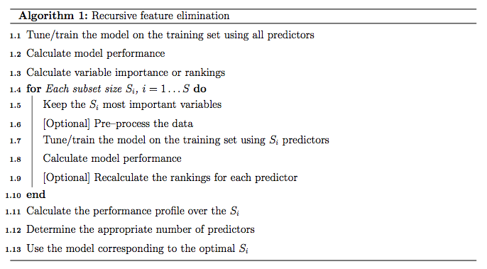

```{r setup, include=FALSE}
knitr::opts_chunk$set(echo = TRUE, warning = FALSE)
library(pROC)
library(readr)
library(plyr)
library(dplyr)
library(caret)
```

## Load datasets
```{r}
setwd("Z:/Cristina/Section3/paper_notes_section3_MODIFIED")
allNMEs_dynamic <- read_csv("datasets/dyn_roi_records_allNMEs_descStats.csv")
allNMEs_morphology <- read_csv("datasets/morpho_roi_records_allNMEs_descStats.csv")
allNMEs_texture <- read_csv("datasets/text_roi_records_allNMEs_descStats.csv")
allNMEs_stage1 <- read_csv("datasets/stage1_roi_records_allNMEs_descStats.csv")

discrall_dict_allNMEs =  read_csv("datasets/named_nxGnormfeatures_allNMEs_descStats.csv")
YnxG_allNME  =  read_csv('datasets/YnxG_allNME.csv')
```

correct some column formating
```{r}
allNMEs_morphology$circularity <- as.numeric(allNMEs_morphology$circularity)
allNMEs_morphology$min_F_r_i <- as.numeric(allNMEs_morphology$min_F_r_i)

allNMEs_texture$texture_contrast_nondir_post1 <- as.numeric(allNMEs_texture$texture_contrast_nondir_post1)
allNMEs_texture$texture_contrast_nondir_post2 <- as.numeric(allNMEs_texture$texture_contrast_nondir_post2)
allNMEs_texture$texture_correlation_nondir_post1 <- as.numeric(allNMEs_texture$texture_correlation_nondir_post1)
allNMEs_texture$texture_correlation_nondir_post3 <- as.numeric(allNMEs_texture$texture_correlation_nondir_post3)
allNMEs_texture$texture_correlation_nondir_post4 <- as.numeric(allNMEs_texture$texture_correlation_nondir_post4)
allNMEs_texture$texture_diffvariance_nondir_post1 <- as.numeric(allNMEs_texture$texture_diffvariance_nondir_post1)
allNMEs_texture$texture_diffvariance_nondir_post2 <- as.numeric(allNMEs_texture$texture_diffvariance_nondir_post2)
allNMEs_texture$texture_diffvariance_nondir_post3 <- as.numeric(allNMEs_texture$texture_diffvariance_nondir_post3)
allNMEs_texture$texture_diffvariance_nondir_post4 <- as.numeric(allNMEs_texture$texture_diffvariance_nondir_post4)
allNMEs_texture$texture_sumvariance_nondir_post1 <- as.numeric(allNMEs_texture$texture_sumvariance_nondir_post1)
allNMEs_texture$texture_sumvariance_nondir_post2 <- as.numeric(allNMEs_texture$texture_sumvariance_nondir_post2)
allNMEs_texture$texture_variance_nondir_post1 <- as.numeric(allNMEs_texture$texture_variance_nondir_post1)
allNMEs_texture$texture_variance_nondir_post2 <- as.numeric(allNMEs_texture$texture_variance_nondir_post2)

allNMEs_stage1$V10 <- as.numeric(allNMEs_stage1$V10)
allNMEs_stage1$V17 <- as.numeric(allNMEs_stage1$V17)
allNMEs_stage1$V19 <- as.numeric(allNMEs_stage1$V19)
allNMEs_stage1$V5 <- as.numeric(allNMEs_stage1$V5)

```

## Process the predictors to a normalized scale
```{r}
# combine all
allNMEs_dynamic <- allNMEs_dynamic %>%
  select(-X1) 
allNMEs_morphology <- allNMEs_morphology %>%
  select(-X1) 
allNMEs_texture <- allNMEs_texture %>%
  select(-X1)
allNMEs_stage1 <- allNMEs_stage1 %>%
  select(-X1)
discrall_dict_allNMEs <- discrall_dict_allNMEs %>%
  select(-X1) 

featDict <- rbind.data.frame(data.frame(Fname = names(allNMEs_dynamic), featureType = "dynamic"),
  data.frame(Fname = names(allNMEs_morphology), featureType = "morphology"),
  data.frame(Fname = names(allNMEs_texture), featureType = "texture"),
  data.frame(Fname = names(allNMEs_stage1), featureType = "stage1"),
  data.frame(Fname = names(discrall_dict_allNMEs), featureType = "NetworkConnectivity"))

print(summary(factor(featDict$featureType)))

# add featere type name for statistics
# combine all
combX_allNME <- cbind(allNMEs_dynamic, allNMEs_morphology, allNMEs_texture, allNMEs_stage1, discrall_dict_allNMEs)


# The predictors are centered and scaled:
normalization <- preProcess(combX_allNME)
print(normalization)

normcombX_allNME <- predict(normalization, combX_allNME)
normcombX_allNME <- as.data.frame(normcombX_allNME)
y <- YnxG_allNME$classNME

print(summary(factor(y)))

```

```{r}
cleaned_data <- na.omit(cbind.data.frame(normcombX_allNME,y))

# ommit the unknown class
labeledy <- cleaned_data %>%
  filter(y != "U") %>%
  select(y)

labeledX <- cleaned_data %>%
  filter(y != "U") %>%
  select(-y)
y <- factor(labeledy$y)


```

## Set Feature selection parameters
```{r}
subsets <- c(c(10, 20, 25, 30, 35, 40, 45, 50, 55, 60, 65, 70, 75), (16:30)*5, c(200, 250, 300, 350, 400, 450, 500))
subsets
```

## Backwards Selection
First, the algorithm fits the model to all predictors. Each predictor is ranked using it's importance to the model. Let $S$ be a sequence of ordered numbers which are candidate values for the number of predictors to retain ($S1 > S2, .$). At each iteration of feature selection, the $S_i$ top ranked predictors are retained, the model is refit and performance is assessed. The value of $S_i$ with the best performance is determined and the top $S_i$ predictors are used to fit the final model. Algorithm 1 has a more complete definition.



The algorithm has an optional step (line 1.9) where the predictor rankings are recomputed on the model on the reduced feature set. Svetnik et al (2004) showed that, for random forest models, there was a decrease in performance when the rankings were re-computed at every step. However, in other cases when the initial rankings are not good (e.g. linear models with highly collinear predictors), re-calculation can slightly improve performance.
```{r}
set.seed(1)
rfFuncs$summary <- twoClassSummary  

RFEcontrol <- rfeControl(functions=rfFuncs, 
                      method = "repeatedcv",
                      repeats = 10, 
                      number = 5,
                      returnResamp="final", 
                      verbose = FALSE)

trainctrl <- trainControl(classProbs= TRUE,
                          summaryFunction = twoClassSummary)

rfeProfile <- rfe(labeledX, y,        # features # classification
              sizes=subsets,             
              rfeControl=RFEcontrol,
              metric = "ROC",
              trControl = trainctrl)
rfeProfile


# The lmProfile is a list of class "rfe" that contains an object fit that is the final linear model with the remaining terms. The model can be used to get predictions for future or test samples.
# The predictors function can be used to get a text string of variable names that were picked in the final model.
predictors(rfeProfile)
rfeProfile$fit

```
## Plot results
```{r}
# There are also several plot methods to visualize the results. plot(lmProfile) produces the performance profile across different subset sizes, as shown in the figure below.

trellis.par.set(caretTheme())
plot(rfeProfile, type = c("g", "o"))
```

## Analayze optimal subset of features (% of types)
```{r}
optimalset <- predictors(rfeProfile)

ftypes <- c()
for(feat in optimalset){
  typefeatrue <- featDict %>%
                    filter(Fname == feat)
  
  ftypes <- c(ftypes, as.character(typefeatrue$featureType))
}

optimalFeatureSet <- data.frame(fnames=optimalset, ftypes=ftypes)

optimalFeatureSet %>%
  group_by(ftypes) %>%
  tally() %>%
  mutate(freq = n / sum(n))

print(optimalFeatureSet %>% 
  arrange(ftypes))

```

Save to file:
```{r}
write.csv(optimalFeatureSet, "datasets/optimalFeatureSet.csv")
```

